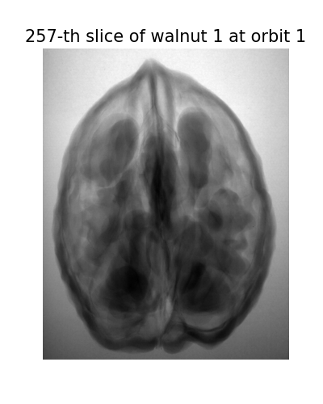
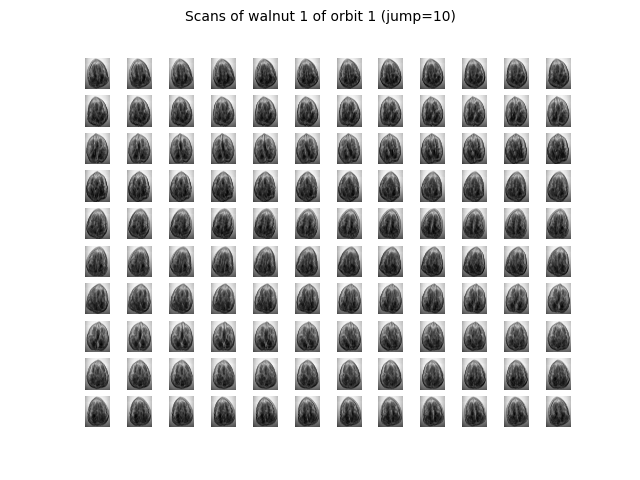

# README

This script analyses how the quality of CT reconstruction is affected by the number of cone beam projections.

## Dataset

The data used here is the cone beam of a walnut, which was built in [paper](https://arxiv.org/abs/1905.04787). Each walnut was scanned with a laboratory X-Ray by rotating it with an angular increment of 3'. 



However, this scanning geometry typically leads to high-cone artefact. To reduce this, scans of three different orbits at different height--low, middle, high--were taken. For a walnut, the corresponding directory contains three sub directory of different orbits, each consisting of 1201 images.



## Image Reconstruction

Python and MATLAB code for reconstruction of walnuts scans were also provided [here](https://github.com/cicwi/WalnutReconstructionCodes). [Feldkamp-Davis-Kress (FDK) algorithm](https://opg.optica.org/josaa/fulltext.cfm?uri=josaa-1-6-612&id=996), a widely used method in cone beam CT (CBCT) reconstruction, was deployed based on the [ASTRA Toolbox](https://www.astra-toolbox.com/), which is a MATLAB and Python toolbox of high-performance GPU primitives for 2D and 3D tomography.

* Install ASTRA Toolbox

  guide could be found [here](https://www.astra-toolbox.com/docs/install.html). It could be troublesome to install packages for CUDA. Here using conda may be a good choice, and remember to include the installation directory of the toolbox to`PYTHONPATH`

```bash
export PYTHONPATH=<path-where-the-toolbox-is-installed>
```

* Download walnut dataset

  Complete data set can be found via the following links: [1-8](https://doi.org/10.5281/zenodo.2686725), [9-16](https://doi.org/10.5281/zenodo.2686970), [17-24](https://doi.org/10.5281/zenodo.2687386), [25-32](https://doi.org/10.5281/zenodo.2687634), [33-37](https://doi.org/10.5281/zenodo.2687896), [38-42](https://doi.org/10.5281/zenodo.2688111)

* Set up configurations

  Set configurations in `fdk.py`, such as `walnut_id`, `orbit_id`, and path to the dataset. To analyse the performance of FDK method on sparse scans, increase `angluar_sub_sampling`with value of 1, such as every scan is used. `angluar_sub_sampling` actually defines the step size of subsampling, so increasing it would induce the number of scans used for reconstruction.

* Run and analyse the result


Through visualisation we could find out that the accuracy decreased with the number of used scans. While by 120 scans the effect of cone angle artefacts was quite high, by 12 scans we could only discern the shape of the walnut. Thus, FDK is insufficient in reconstructing CBCT from sparse scans, more data efficient algorithm is needed for this task. In clinical use, such data efficient method could decrease both the radiation exposure and instrument cost.